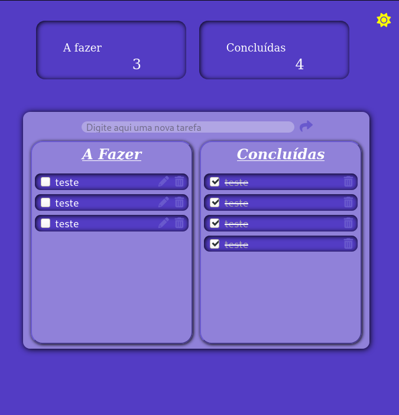

# To Do List

Um projetinho simples, mas que me ajudou bastante...
Estava há um tempinho sem praticar com desenvolvimento web e resolvi treinar um pouquinho.
Não está perfeito, ainda tem o que melhorar, mas o esforço valeu muito a pena, consegui aprender umas coisinhas novas enquanto aplicava outras que já conhecia. Ainda tenho muito a estudar, acredito que com muita dedicação, o que com certeza não falta, ...e talvez um pouco de café...consigo evoluir bastante as minhas habilidades na área.

Uma das primeiras coisas que aprendi quando etrei no mundo da programação é que o papel de um programador não é exatamente escrever código, nosso papel é encontrar a solução para um problema! Guardei isso e estou levando para frente, desenvolvendo minhas habilidades para poder aplicar esse pensamento :)

* O projeto consiste em uma to do list, onde cada tarefa adicionada pode ser editada ou excluída. Há um menu lateral com um dashboard simples mostrando ao usuário quantas tarefas estão pendentes e quantas já foram concluídas, contanto ainda com o modo escuro e com um layout responsivo.

    
    

    
    

    
    

